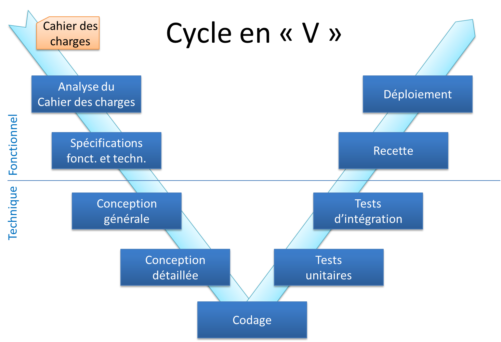
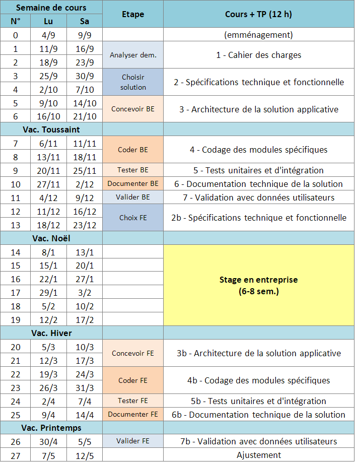
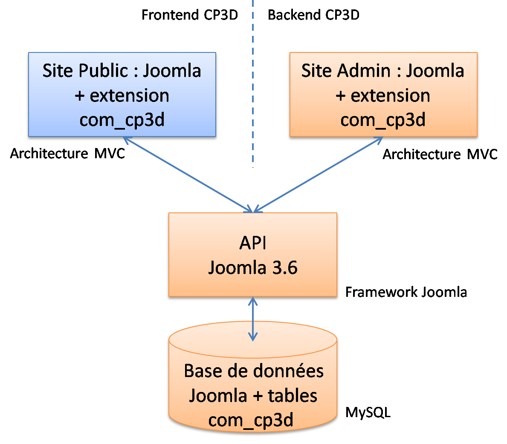
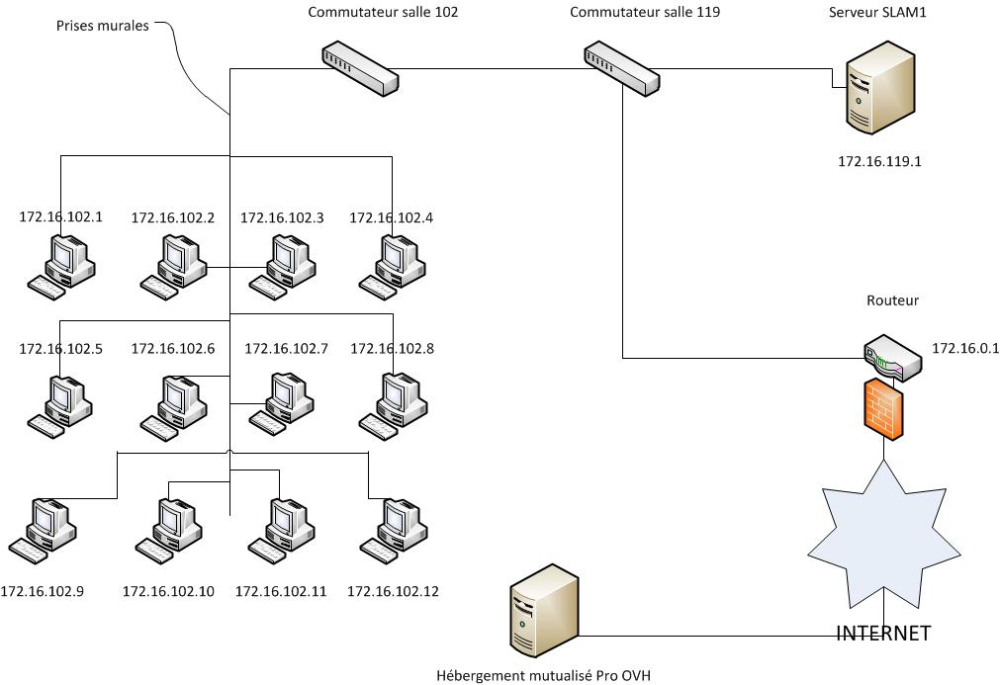

# Site et appli ArVie - Documentation technique

## Cahier des Charges

### Présentation du Lycée Louis-Armand

Le Lycée Louis-Armand est un établissement public...

_(A compléter par **Allan**)_

### Objectif du projet ArVie

L'objectif du projet ArVie est de développer…

_(A compléter par **Allan**)_

### Analyse de l'existant

Le site du Lycée Louis-Armand…

_(A compléter par **Allan**)_

### Analyse des besoins

Les besoins du site ArVie sont les suivants…

_(A compléter par **Allan**)_

## Organisation du projet ArVie

### Organisation générale du projet

L'organisation du projet ArVie mise en place par le professeur en charge
des modules SLAM4, SLAM5 et PPE3-4, a coïncidé avec la progression
pédagogique établie pour ces modules, le projet ArVie servant de fil
conducteur au déroulé des cours, travaux pratiques et PPE.

Le projet ArVie a d'abord été décomposé en trois livrables principaux liés
à l'architecture du framework Joomla retenu et présenté plus loin (cf.
chapitre conception et architecture) :

- Le site d'administration, avec le développement de la partie backend du composant com_arvie (extension Joomla spécialement développée pour le projet).

- Le site public à accès réservé aux adhérents (directeur, professeurs, élèves, etc.) avec la configuration du CMS Joomla et le développement de la partie frontend du composant com_arvie.

- Le développent de l'application mobile Android et de l'API associée.

### Approche méthodologique

Le développement s'est fait selon la méthodologie du cycle de vie des
logiciels (cycle en « V ») définissant les grandes étapes du projet depuis
l'élaboration du cahier des charges jusqu'à la recette fonctionnelle et
le déploiement :

Les étapes d'analyse du cahier des charges et de spécifications fonctionnelles
et techniques ont été communes aux trois sous-projets correspondants aux
trois livrables principaux.

### Planning général

Le planning général du projet ArVie et de ses trois sous-projets s'est
inscrit dans le calendrier (progression pédagogique) mis en place sur
l'année scolaire 2017-2018 comme suit :

### Gestion du projet

Des groupes de travail ont été constitués pour faciliter le partage de
connaissance et la collaboration entre les étudiants mis en situation
professionnelle lors des travaux pratiques.

Des contributions individuelles au projet ont été aussi demandées à
chaque étudiant pour permettre à chacun de développer son autonomie.

Les tableaux suivants identifient, pour le backend puis pour le frontend,
les **responsables par domaine et table** (ou classes métier du modèle
des données, telles que définies plus bas dans le chapitre des spécifications
fonctionnelles) :

**Backend :**

| **Domaine**   | **Table**              | **MVC Liste** | **MVC Détail** |
| ------------- | ---------------------- | ------------- | -------------- |
| Utilisateurs  | utilisateurs           | Nicolas       | Allan          |
|               | abonnements            | Khalil        | Khalil         |
|               | parrains               | Nicolas       | Nicolas        |
| Groupe        | groupes                | Salimou       | Salimou        |
|               | groupe_utilisateur_map | Maxime        | Maxime         |
|               | roles                  | Salimou       | Salimou        |
|               | metiers                | Allan         | Allan          |
|               | metier_groupe_map      | Nicolas       | Nicolas        |
| Partage       | publications           | Kayumars      | Kayumars       |
|               | evenements             | Gregory       | Gregory        |
|               | utilisateur_even_map   | Gregory       | Gregory        |
| Communication | discussions            | Ana           | Ana            |
|               | utilisateur_discu_map  | Ana           | Ana            |
|               | messages               | Jérémie       | Sakana         |

**Frontend :**

| **Domaine**   | **Table**    | **Direction** | **Agent** | **Prof.** | **Eleve** | **Ancien** |
| ------------- | ------------ | ------------- | --------- | --------- | --------- | ---------- |
| Utilisateur   | utilisateurs | Nicolas       | Maxime    |           |           |            |
|               | abonnements  | Khalil        |           |           |           |            |
|               | parrains     | Maxime        |           |           |           |            |
| Groupe        | groupes      | Salimou       |           |           |           |            |
| Partage       | publications | Kayumars      | Grégory   |           |           |            |
|               | evenements   | Jérémie       |           |           |           |            |
| Communication | discussions  | Allan         | Ana       |           |           |            |
|               | messages     | Sakana        |           |           |           |            |

_(A compléter par **Sakana**)_

La gestion du projet ArVie….

### Gestion des versions logicielles

La gestion des versions logicielles….

_(A compléter par **Nicolas**)_

## Spécifications fonctionnelles

Le site ArVie se décompose en deux parties :

- Le **backend ArVie** , site d'administration du site ArVie.
- Le **frontend ArVie** , site ArVie constitué d'une partie publique et d'une partie à accès réservé aux utilisateurs enregistrés.

Les présentes spécifications fonctionnelles définissent les acteurs, les
diagrammes de cas d'utilisation et les diagrammes de séquence associés,
les interfaces utilisateurs et le modèle des données commun aux deux sites.

### Acteurs

Au sens UML, les acteurs concernés par le système ArVie sont les suivants :

- Backend ArVie : Administrateur.
- Frontend ArVie : Direction, Agent, Professeur, Elève et Ancien.

### Diagramme de cas d'utilisation du backend ArVie

Le diagramme des cas d'utilisation du backend ArVie est le suivant :

_(A compléter par **Maxime**)_

### Diagramme de cas d'utilisation du frontend ArVie

Le diagramme des cas d'utilisation du frontend ArVie est le suivant :

_(A compléter par **Maxime**)_

### Diagrammes de séquence du backend ArVie

Les diagrammes de séquence du backend ArVie associés aux cas d'utilisation
du backend définis plus haut ont été ensuite développés en notation UML 2.
En voici quelques exemples :

_(A compléter par **Khalil**)_

### Diagrammes de séquence du frontend ArVie

Les diagrammes de séquence du frontend ArVie associés aux cas d'utilisation
du frontend définis plus haut ont été ensuite développés en notation UML 2.
En voici quelques exemples :

_(A compléter par **Khalil**)_

### Interfaces utilisateurs du backend ArVie

Voici la page d'accueil du backend ArVie…

_(A compléter par **Nicolas**)_

### Interfaces utilisateurs du frontend ArVie

Voici la page d'accueil du frontend ArVie…

_(A compléter par **Nicolas**)_

### Modèle des données ArVie

Le modèle des données ArVie est le suivant…

_(A compléter par **Nicolas**)_

## Spécifications techniques

### Framework et CMS Joomla

Afin de réduire les risques liés à la maîtrise d'œuvre d'un tel projet,
l'équipe projet ArVie a retenu le principe d'une architecture logicielle
ouverte (architecture MVC : Modèle-Vue-Contrôleur) avec Framework/CMS
Joomla 3.6 et un développement PHP en deux phases :

1. Développement du backend ArVie et de la base de données « ArVie» sous la forme d'un composant « com_arvie » installable dans le CMS Joomla 3.5.

2. Développement du frontend ArVie avec le composant « com_arvie » pour implémenter les fonctionnalités attendues des utilisateurs.

La technologie Joomla a été choisie parmi les trois CMS (Content Management
System : outil de gestion de contenu sur Internet) open-source et gratuits
les plus populaires du marché : WordPress, Drupal et Joomla. Sa simplicité
d'utilisation, la qualité de ses extensions et le dynamisme de ses communautés
d'utilisateurs et de développeurs en France, en Europe et dans le monde
assurent à Joomla un suivi et une évolution de très grande qualité.

Le schéma d'architecture logicielle est le suivant :

Les éléments coloriés en orange correspondent aux développements relatifs
à la première phase et comprend les deux éléments du socle commun, la base
données Joomla sous MySQL et l'installation de l'API Joomla 3.6, permettant
ensuite l'intégration du composant « com_arvie » spécialement développé
pour les besoins du site ArVie.

L'élément colorié en bleu correspond à la deuxième phase du développement
explicitée ci-dessus.

_(A compléter par **Ana**)_

### Environnements de développement, tests et production

L'environnement de développement et de test qui a été mis en place est le suivant :

- Installation sur chaque PC étudiant de :
	- ** XAMPP 5.6.15** (PHP 5.6.15, MySQL 5.0.11, Apache 2.4.7, phpMyAdmin 4.5.1)
	- ** NotePad++ 7.2.2**
	- ** Joomla 3.6**

- Installation sur le serveur du labo SLAM :
	- Machine virtuelle Debian 8.2
	- Services Apache2, PHP et MySQL
	- Logiciel phpMyAdmin

L'environnement de production choisi a été une plateforme mutualisée de
l'hébergeur OVH.com (offre Pro sur serveur LAMP) dont les détails sont
donnés dans le chapitre déploiement.

_(A compléter par **Ana**)_

## Conception de la solution

### Architecture logicielle MVC

Le choix d'une architecture MVC répond aux besoins d'ouverture, de
maintenance et d'évolutivité du site par une organisation standardisée
du code source. Le but d'une telle architecture est de structurer le code,
pour chaque cas d'utilisation ou bloc fonctionnel, en trois parties :

- Le **modèle** gère les données du site. Il récupère les informations dans la base de données, les organise et les assembles pour qu'elles puissent ensuite être traitées par le contrôleur et la vue. Cette partie contient donc les requêtes SQL organisées sous forme de fonctions PHP.
- La **vue** gère l'affichage. Elle organise la façon dont les données sont affichées à l'écran.On y trouve essentiellement du code HTML mais aussi quelques boucles et conditions PHP très simples.
- Le **contrôleur** gère la logique du code et les demandes utilisateurs. Le contrôleur récupère les données du modèle, les analyse/les traite, et renvoie les données à afficher à la vue. Le contrôleur contient exclusivement du code PHP, organisé sous forme de fonctions.

L'architecture du composant com_arvie respecte l'arborescence et les
règles de nommage définies pour la plateforme Joomla 3.6.

### Architecture du backend de com_arvie

L'arborescence des dossiers du backend du composant com_arvie (dossier
www.ArVie.com/administrator/components/com_arvie) est la suivante :

_(A compléter par **Nicolas**)_

Les règles de nommage des fichiers php des contrôleurs, modèles et vues sont les suivantes :

- nom au pluriel pour les listes (ex : entreprises)
- nom au singulier pour les formulaires de détail (ex : entreprise)

Ainsi, le dossier **controllers** comprend les fichiers php suivants :

- commande
- commandes
- entreprise
- entreprises
- …

_(A compléter par **Nicolas**)_

### Architecture du frontend de com_arvie

L'arborescence du frontend du composant com_arvie...

_(A compléter par **Nicolas**)_

### Architecture matérielle

L'infrastructure réseau mise en œuvre pour le développement de ArVie est la suivante :

_(A compléter par **Jérémie**)_

## Codage du composant com_arvie

### Codage MVC de com_arvie

Les contrôleurs, modèles, tables et vues constituant le code PHP du
composant com_arvie selon l'arborescence et les règles de nommage des
fichiers définis plus-haut sont conçus comme des classes PHP héritant des
classes correspondantes du framework Joomla : JController, JModel et JView.

Un exemple de code PHP commenté pour ces trois types de classes est présenté ci-après.

_(A compléter par **Ana**)_

## Application AndroidArVie

### Architecture de la solution

Côté serveur, une API de test a été spécialement développée en php pour
pouvoir consulter la base de données ArVie à travers le framework Joomla
par le protocole http.

Côté client, application Android a été développée en Java pour permettre
à l'utilisateur « client » disposant d'une tablette ou d'un téléphone
Android de se connecter à l'API par le protocole http et consulter ensuite
les offres et ses candidatures.

En environnent de développement, serveur et terminal Android sont connecté
au même réseau local.

_(A compléter par **Salimou**)_

### Android Studio

Conformément aux dernières recommandations de Google, l'environnement de
développement Android Studio a été choisi pour concevoir et testerl'application
AndroidArVie.

_(A compléter par **Salimou**)_

### Cas d'utilisation

Les cas d'utilisation retenus pour l'application AndroidArVie sont les suivants :

_(A compléter par **Maxime**)_

### Structure et code de l'application

La structure de l'application AndroidArVie est la suivante :

_(A compléter par **Salimou**)_

## Intégration et tests d'intégration du site ArVie

### Création du composant packagé com_arvie.zip

Il s'agit de créer un composant packagé **com_arvie.zip** installable
depuis le CMS Joomla 3.6 et contenant…

_(A compléter par **Kayumars**)_

### Test d'installation du composant packagé com_arvie.zip

_(A compléter par **Kayumars**)_

### Test de l'API

Il s'agit de tester la bonne intégration de l'API du site ArVie et des
vues correspondantes dans la base de données depuis un navigateur Internet
par l'envoi de requêtes HTTP avec les url définies dans l'API et retournant
le code JSON attendu.

_(A compléter par **Kayumars**)_

## Tests et recette fonctionnelle

### Tests du backend ArVie

Le cahier de tests du backend ArVie comprend pour chaque cas d'utilisation
identifié lors des spécifications une fiche de test selon modèle suivant :

_(A compléter par **Sakana**)_

### Tests du frontend ArVie

Les tests du frontend ArVie se sont déroulés selon le même principe que
ceux du backend, à partir d'un cahier de tests composé de fiches de tests
associées aux cas d'utilisation spécifiés dans le frontend.

_(A compléter par **Sakana**)_

### Tests de l'application AndroidArVie

Les tests de l'application AndroidArVie...

_(A compléter par **Sakana**)_

## Déploiement

Le déploiement du site ArVie s'est fait sur une plateforme mutualisée LAMP
hébergée chez OVH, après achat du nom de domaine disponible lla-sio.fr et
de l'hébergement Pro pour un an (5,99 €HT/mois), de la façon suivante :

1. Préparation des fichiers à télécharger :
	- Export de la base de données ArVie complète au format SQL (CMS Joomla + extension com_arvoe).
	- Copie du fichier ArVie.sql à la racine de l'arborescence des fichiers du site egs.com.

2. Préparation de la plateforme d'hébergement :
	- Création du sous domaine ArVie dans www.lla-sio.fr.
	- Création du répertoire ArVie à la racine www du site (correspondant au sous-domaine).
	- Création de la base de données sous MySQL.

3. Téléchargement des fichiers :
	- Téléchargement de l'arborescence des fichiers par FTP dans le répertoire www du serveur OVH.

4. Installation de la base de données :
	- Import de la base de données avec phpMyAdmin (serveur OVH).

5. Tests :
	- Test du site public à l'url : [www.lla-sio.fr/ArVie](http://www.lla-sio.fr/cp3d)
	- Test du site public à l'url : [www.lla-sio.fr/ArVie/administrator](http://www.lla-sio.fr/cp3d/administrator)

_(A compléter par **Jérémie**)_